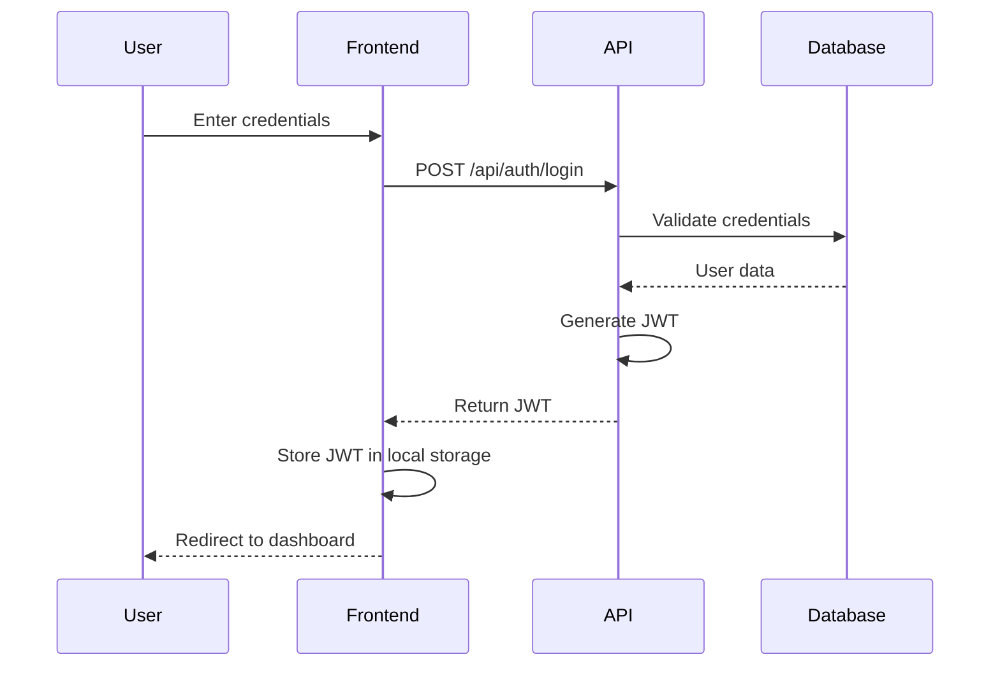
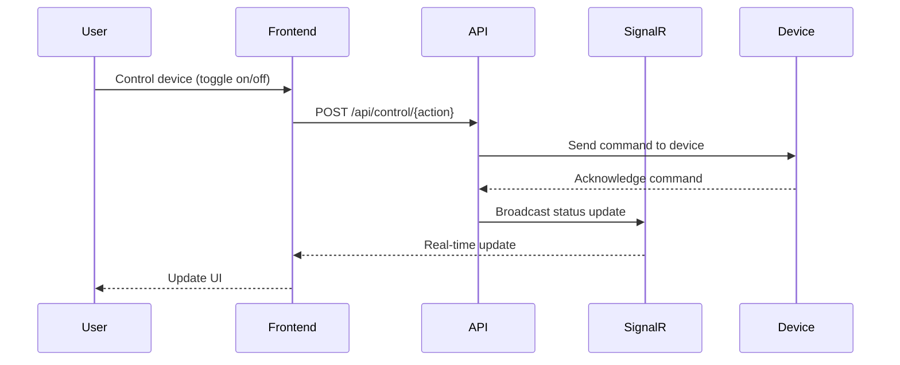
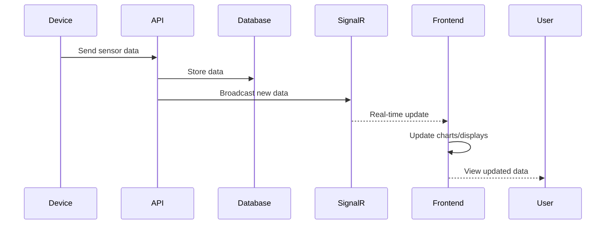
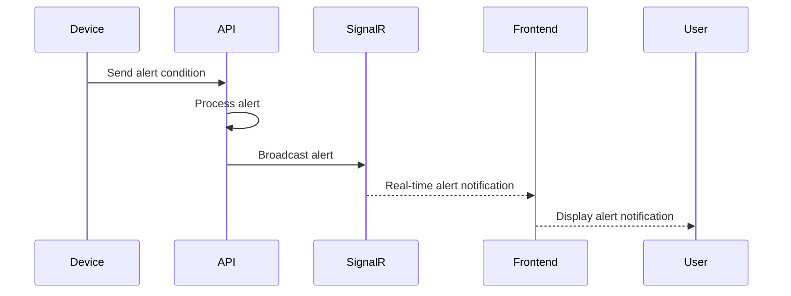
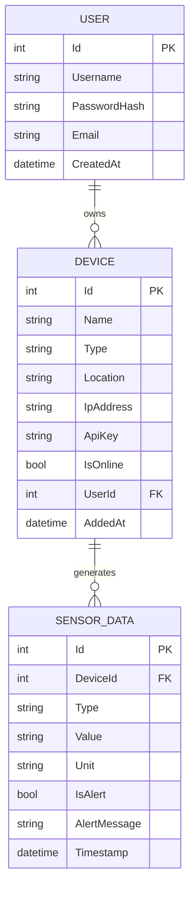

# Smart Home Dashboard Project Report

## Introduction

The Smart Home Dashboard is a comprehensive web application that allows users to manage and monitor their smart home devices from a centralized interface. This system integrates various IoT devices such as lights, thermostats, security cameras, and sensors, providing real-time monitoring, control, and automation capabilities. The dashboard presents device statuses, sensor readings, alerts, and enables users to remotely control their smart home environment.

### Key Features and Functionalities

1. **User Authentication and Authorization**
   - Secure login and registration system
   - JWT-based authentication
   - Role-based access control

2. **Device Management**
   - Add, edit, and remove devices
   - Categorize devices by type and location
   - Monitor device status (online/offline)

3. **Real-time Monitoring**
   - Live sensor data visualization
   - Historical data tracking
   - Alerts and notifications for anomalies

4. **Remote Control**
   - Turn devices on/off
   - Adjust device settings (brightness, temperature, etc.)
   - Schedule automated actions

5. **Security Features**
   - Monitor security devices
   - Receive breach alerts
   - View security camera feeds

## Problem Definition & Objectives

### Problem Definition

Modern homes increasingly incorporate smart devices that operate independently with separate applications, creating a fragmented user experience. This leads to:

1. **Management Complexity**: Users struggle to manage multiple devices across different platforms
2. **Lack of Integration**: Devices from different manufacturers cannot easily communicate with each other
3. **Limited Automation**: Difficulty in creating cross-device automation rules
4. **Security Concerns**: Multiple systems create potential security vulnerabilities
5. **Data Utilization**: Valuable data from various devices remains siloed

### Objectives

1. **Centralized Management**: Create a single platform to manage all smart home devices
2. **Real-time Monitoring**: Provide live status updates of all connected devices
3. **Secure Access**: Implement robust authentication and authorization
4. **Data Visualization**: Display sensor data through intuitive dashboards
5. **Remote Control**: Enable remote device operation from anywhere
6. **API Integration**: Support various device APIs and protocols
7. **Responsive Design**: Ensure the dashboard works well on desktop and mobile devices
8. **Notification System**: Alert users about important events or anomalies
9. **Historical Data**: Store and analyze device data for insights and trends

## System Design

### Tech Stack

#### Frontend
- **Framework**: React 19.0.0
- **Routing**: React Router DOM 7.4.0
- **UI Framework**: Bootstrap 5.3.3
- **HTTP Client**: Axios 1.8.4
- **Real-time Communication**: SignalR (Microsoft SignalR 8.0.7)
- **Development Tools**: React Scripts, Testing Library

#### Backend
- **Framework**: ASP.NET Core 9.0
- **API Development**: ASP.NET Web API
- **Authentication**: JWT (JSON Web Tokens)
- **Real-time Communication**: SignalR
- **API Documentation**: Swagger/OpenAPI

#### Database
- **DBMS**: MySQL
- **ORM**: Entity Framework Core 9.0.3
- **MySQL Provider**: Pomelo.EntityFrameworkCore.MySql 9.0.0

#### Authentication
- **Method**: JWT (JSON Web Tokens)
- **Password Security**: BCrypt.Net-Next 4.0.3
- **Token Management**: JwtBearer 9.0.3

### Sequence Diagrams

#### User Authentication Flow



#### Device Control Flow



#### Sensor Data Flow



#### Alert Notification Flow



## Component Breakdown and API Design

### Frontend Components

1. **Authentication Components**
   - `Login.js`: User login form
   - `Register.js`: New user registration

2. **Dashboard Components**
   - `Dashboard.js`: Main dashboard showing overview of all devices
   - `DeviceList.js`: List of all devices with status indicators
   - `DeviceDetail.js`: Detailed view of a specific device
   - `DeviceForm.js`: Form to add/edit devices
   - `SensorReadings.js`: Display sensor data with charts

3. **Utility Components**
   - `api.js`: API integration and HTTP request handling

### API Design

#### Authentication and Authorization

The system uses JWT (JSON Web Tokens) for authentication with tokens stored in local storage. The authentication flow includes:

1. User registration via `POST /api/auth/register`
2. User login via `POST /api/auth/login`
3. Token validation for protected routes
4. Role-based access control for admin functionality

#### Authentication Flow

1. User submits login credentials
2. Server validates credentials and generates JWT token
3. Token is returned to client and stored
4. Token is included in Authorization header for subsequent requests
5. Server validates token for protected routes

#### RBAC (Role-Based Access Control)

While not fully implemented yet, the system is designed to support different roles:
- Regular users: Can manage their own devices
- Admin users: Can manage all devices and users

#### API Endpoints

1. **Authentication Endpoints**
   - `POST /api/auth/register`: Register new user
   - `POST /api/auth/login`: Login and get JWT token

2. **Device Endpoints**
   - `GET /api/devices`: Get all devices
   - `GET /api/devices/{id}`: Get device by ID
   - `POST /api/devices`: Add new device
   - `PUT /api/devices/{id}`: Update device
   - `DELETE /api/devices/{id}`: Delete device

3. **Sensor Endpoints**
   - `GET /api/sensors`: Get all sensor data
   - `GET /api/sensors/{deviceId}`: Get sensor data by device
   - `POST /api/sensors`: Add new sensor reading
   - `GET /api/sensors/history/{deviceId}`: Get historical data

4. **Control Endpoints**
   - `POST /api/control/toggle/{deviceId}`: Toggle device on/off
   - `POST /api/control/settings/{deviceId}`: Update device settings

## Database Design & Storage Optimization

### Entities and Relationships

The database consists of three main entities with the following relationships:

1. **User** - Represents system users
2. **Device** - Represents smart devices owned by users
3. **SensorData** - Represents data readings from devices

### Devices Table

```
Table: Devices
- Id (PK): int
- Name: string (100)
- Type: string (50)
- Location: string (100)
- IpAddress: string
- ApiKey: string (100)
- IsOnline: bool
- UserId (FK): int
- AddedAt: DateTime
```

### SensorData Table

```
Table: SensorData
- Id (PK): int
- DeviceId (FK): int
- Type: string
- Value: string
- Unit: string
- IsAlert: bool
- AlertMessage: string (255)
- Timestamp: DateTime
```

### Users Table

```
Table: Users
- Id (PK): int
- Username: string (50)
- PasswordHash: string (255)
- Email: string (100)
- CreatedAt: DateTime
```

### ER Diagram



## Snapshots of the Application

### Application Screenshots
[Screenshots of the UI would be included here]

### Database and Configuration Files

#### MySQL Screenshots
[Screenshots of MySQL database would be included here]

#### appsettings.json Code Snippet
```json
{
  "ConnectionStrings": {
    "DefaultConnection": "server=localhost;database=smart_home_db;user=root;password=your_password"
  },
  "Jwt": {
    "Key": "YourSecretKeyHere",
    "Issuer": "SmartHomeApi",
    "Audience": "SmartHomeDashboard"
  },
  "Logging": {
    "LogLevel": {
      "Default": "Information",
      "Microsoft.AspNetCore": "Warning"
    }
  },
  "AllowedHosts": "*"
}
```

## Conclusion

The Smart Home Dashboard provides a comprehensive solution for managing and monitoring smart home devices. By centralizing device control and data visualization, it addresses the problem of fragmented smart home systems. The application's architecture leverages modern web technologies for the frontend and a robust .NET Core backend with MySQL database for data storage.

The real-time capabilities powered by SignalR enable immediate updates and notifications, enhancing the user experience. The JWT-based authentication system ensures secure access to the dashboard and device controls. The system's modular design allows for easy expansion to support additional device types and features in the future. 